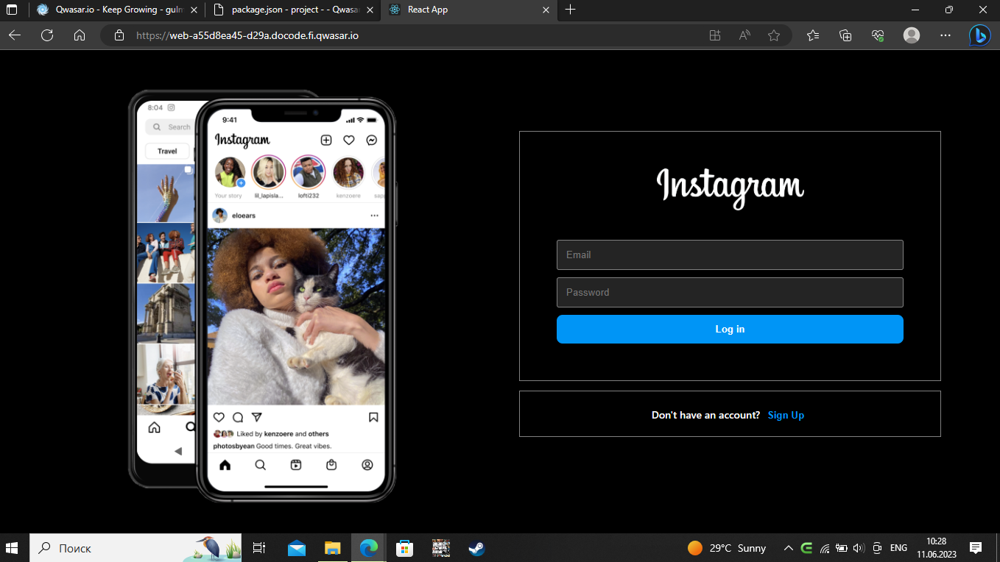
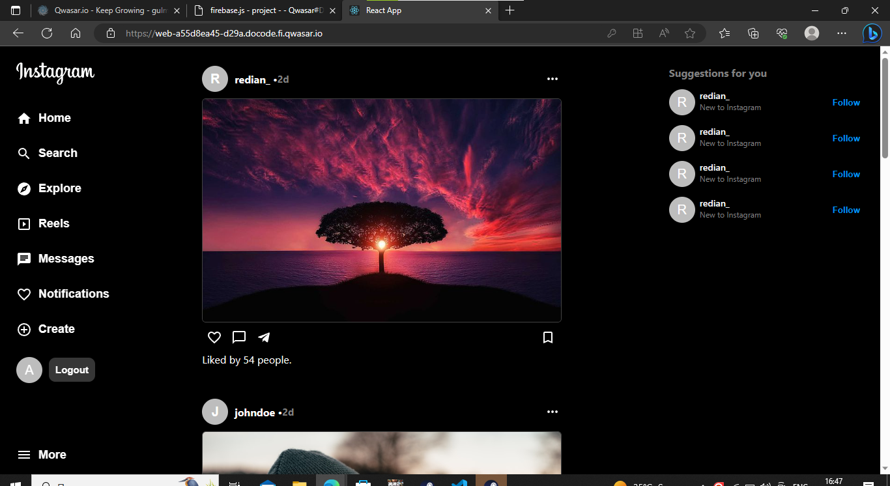

# Instagram
Welcome to my Instagram project!

In this project I have tried to create a clone of the Instagram app

# Ackknowladgement 

- [React JS](https://reactjs.org/)
- [Firebase](https://console.firebase.google.com/)-

# Authors

Github
- [@Gulmuradov](https://github.com/Gulmuradov/)

# Installation 

```
  npx create-react-app .
```

## Run Locally

Go to the project directory

```bash
  cd instagram-clone
```

Install dependencies

```bash
  npm install
```

Start the server

```bash
  npm run start
```

## Images


